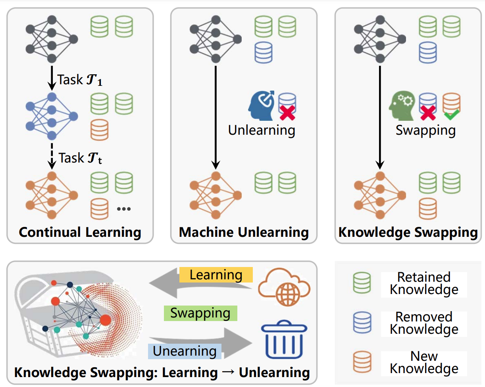

# KnowledgeSwapping
This is the official code implementation of Knowledge Swapping via Learning and Unlearning(https://arxiv.org/pdf/2502.08075). 
Knowledge Swapping is a novel
task designed to selectively regulate knowledge
of a pretrained model by enabling the forgetting
of user-specified information, retaining essential
knowledge, and acquiring new knowledge simultaneously.


# Getting Started
## Installation
Download the repo:
```angular2html
git clone https://github.com/xingmingyu123456/KnowledgeSwapping.git
cd KnowledgeSwapping
```
Install needed packages:
```angular2html
conda create -n swapping python=3.12
conda activate swapping
pip install -r requirements.txt
```
Compiling CUDA operators
```angular2html
cd object-dection/models/dino/ops
python setup.py build install
# unit test (should see all checking is True)
python test.py
cd ../../..
```
## Dataset

### Image Classification
- **Learning Set:** 5 or 10 classes from CUB-200-2011, Oxford-IIIT Pet, RESISC45, PlantVillage  
- **Forgetting Set:** 5 classes from ImageNet100  
- **Retaining Set:** Remaining 95 classes from ImageNet100  
- Download Links 
  - 5 classes: [link](https://mailhfuteducn-my.sharepoint.com/:u:/g/personal/2022213423_mail_hfut_edu_cn/EekTshGwCr5JmwQZPv4UOSsBecHKQ8Qu5w3EXhvoWLfP4A?e=v9SNZA)  
  - 10 classes: [link](https://mailhfuteducn-my.sharepoint.com/:u:/g/personal/2022213423_mail_hfut_edu_cn/Ee4hedQXjHdCh47mkOntmeEBOGxBUoc3OIxVwohsPNKa6g?e=elIt9b)

### Object Detection
- **Learning Set:** 5 classes from CUB-200-2011, Stanford Dogs  
- **Forgetting Set:** 5 classes from COCO  
- **Retaining Set:** Remaining 75 classes from COCO  
- [Download Link](https://mailhfuteducn-my.sharepoint.com/:f:/g/personal/2022213423_mail_hfut_edu_cn/EkqbtJ21ezZMiKb2cuxAn3oBomEch45MAMQcFRYdm5jTcw?e=OIilWn)

### Semantic Segmentation
- **Learning Set:** 6 classes from VOC, COCO, Oxford-IIIT Pet, DeepGlobe Land  
- **Forgetting Set:** 5 classes from ADE20K  
- **Retaining Set:** Remaining 145 classes from ADE20K
- [Download Link](https://mailhfuteducn-my.sharepoint.com/:f:/g/personal/2022213423_mail_hfut_edu_cn/ElNn_QcPYFZGg7HdVrQdvz8BPY7cHW1YHtjiaCAkUj21Aw?e=YaVDfP)  


## Pretrained model
VIT_B16 pretrained on imagenet100:[link]( https://mailhfuteducn-my.sharepoint.com/:f:/g/personal/2022213423_mail_hfut_edu_cn/EkOrzUDf9wJFj4WPF9_uFgwBe9BNugCSdGgjMefhO6YCvw?e=hCkfeI)

DINO pretrained on COCO:[link](https://mailhfuteducn-my.sharepoint.com/:f:/g/personal/2022213423_mail_hfut_edu_cn/EkepEZ2K0YpAjKxI1yzxGt0BgM66JTR3tyqUpzPwCC4_CQ?e=K47LCD)

Mask2Former pretrained on ADE20k:[link](https://mailhfuteducn-my.sharepoint.com/:f:/g/personal/2022213423_mail_hfut_edu_cn/EnQek4tbH8xFmsVc0unWbEgBAC27s_jIavy6wQC8edvDbQ?e=qTW3wG)

## Image Classification
first learn then forget
```angular2html
cd image-classification
CUDA_VISIBLE_DEVICES=0 python3 -u train/exchange_fltf.py -b 80 -w 0 -d casia100 -n VIT -e 5 \
-head Softmax --outdir /your/outdor/path --warmup-epochs 0 --lr 1e-2   --num_workers 8  \
--lora_rank 8 --decay-epochs 100 --vit_depth 12 -r /your/pretrained_model/path \
--BND 105 --beta 0.2 --alpha 0.005 --min-lr 1e-5 --wandb_group swapping --learnpath /learnset/path \
--forgetpath /forgetset/path --retainpath /retainset/path

#example
CUDA_VISIBLE_DEVICES=4 python3 -u train/exchange_fltf.py -b 80 -w 0 -d casia100 -n VIT -e 5 \
-head Softmax --outdir /home/xmy/code/classify-bird/result/cub_learn_5_fftl \
--warmup-epochs 0 --lr 1e-2   --num_workers 8  --lora_rank 8 --decay-epochs 100 \
--vit_depth 12 -r /home/xmy/code/imagenet100_small_checkpoint_2024-09-27-00-31-30.bin \
--BND 105 --beta 0.2 --alpha 0.005 --min-lr 1e-5 --wandb_group swapping \
--learnpath /home/xmy/code/classify-bird/dataset/classification10/crop_disease_learn \
--forgetpath /home/xmy/code/classify-bird/dataset/classification10/imagenet100_small_forget \
--retainpath /home/xmy/code/classify-bird/dataset/classification10/imagenet100_small_remain

```
first forget then learn
```angular2html
cd image-classification
CUDA_VISIBLE_DEVICES=0 python3 -u train/exchange_fftl.py -b 80 -w 0 -d casia100 -n VIT -e 5 \
-head Softmax --outdir /your/outdor/path --warmup-epochs 0 --lr 1e-2   --num_workers 8  \
--lora_rank 8 --decay-epochs 100 --vit_depth 12 -r /your/pretrained_model/path \
--BND 105 --beta 0.2 --alpha 0.005 --min-lr 1e-5 --wandb_group swapping --learnpath /learnset/path \
--forgetpath /forgetset/path --retainpath /retainset/path
```
## Object Detection
first learn then forget
```angular2html
cd object-detection
CUDA_VISIBLE_DEVICES=0,1 torchrun --nproc_per_node=2 swapping_fltf_ddp.py \
--pretrain_model_path /your/pretrained_model/path -c ./config/DINO/DINO_4scale_swin_swap.py \
--lora_rank 8 --lora_pos="FFN" --options dn_scalar=100 embed_init_tgt=TRUE \
dn_label_coef=1.0 dn_bbox_coef=1.0 use_ema=False dn_box_noise_scale=1.0 \
--forget_path /your/forgetset/path --learn_path /your/learnset/path \
--remain_path /your/retainset/path --output_dir /your/output_dir/path --save_log --find_unused_params
#example
CUDA_VISIBLE_DEVICES=5,7 torchrun --nproc_per_node=2 swapping_fltf_ddp.py --pretrain_model_path \
/data1/xmy/DINO/logs/swin4c01-14-14-47-40-cl101/checkpoint0004.pth -c ./config/DINO/DINO_4scale_swin_swap.py \
--lora_rank 8 --lora_pos="FFN" --options dn_scalar=100 embed_init_tgt=TRUE dn_label_coef=1.0 dn_bbox_coef=1.0 \
use_ema=False dn_box_noise_scale=1.0 --forget_path /data1/xmy/DINO/data/coco0120/cocobench_forget \
--learn_path /data1/xmy/DINO/data/doglearn --remain_path /data1/xmy/DINO/data/coco0120/cocobench_remain \
--output_dir /data1/xmy/DINO/logs/swin4c --save_log --find_unused_params
```
first forget then learn
```angular2html
cd object-detection
CUDA_VISIBLE_DEVICES=0,1 torchrun --nproc_per_node=2 swapping_fftl_ddp.py \
--pretrain_model_path /your/pretrained_model/path -c ./config/DINO/DINO_4scale_swin_swap.py \
--lora_rank 8 --lora_pos="FFN" --options dn_scalar=100 embed_init_tgt=TRUE \
dn_label_coef=1.0 dn_bbox_coef=1.0 use_ema=False dn_box_noise_scale=1.0 \
--forget_path /your/forgetset/path --learn_path /your/learnset/path \
--remain_path /your/retainset/path --output_dir /your/output_dir/path --save_log --find_unused_params
```
## Semantic Segmentation
first learn then forget
```angular2html
cd semantic-segmentation
CUDA_VISIBLE_DEVICES=0,1 python swapping_fltf.py  --num-gpus 2 --config-file \
configs/ade20k/semantic-segmentation/swin/maskformer2_swin_base_IN21k_swap.yaml \
--learnsetname xxx --learnset /your/learnset/path --forgetset /your/forgetset/path \
--retainset /your/forgetset/path  MODEL.WEIGHTS /your/pretrained_model/path \
SOLVER.IMS_PER_BATCH 6 OUTPUT_DIR /your/output_dir/path
#example
CUDA_VISIBLE_DEVICES=4,5 python swapping_fltf.py  --num-gpus 2 \
--config-file configs/ade20k/semantic-segmentation/swin/maskformer2_swin_base_IN21k_swap.yaml \
--learnsetname voc --learnset /data1/xmy/Mask2Former-main/data/voclearn \
--forgetset /home/xmy/code/Mask2Former-main/datasets/adebased/forgetsmall \
--retainset /home/xmy/code/Mask2Former-main/datasets/adebased/remainsmall \
MODEL.WEIGHTS /data1/xmy/Mask2Former-main/exp/log/11-23-18-53/model_0002999.pth \
SOLVER.IMS_PER_BATCH 6 OUTPUT_DIR /data1/xmy/Mask2Former-main/exp/log
```
first forget then learn
```angular2html
cd semantic-segmentation
CUDA_VISIBLE_DEVICES=0,1 python swapping_fftl.py  --num-gpus 2 --config-file \
configs/ade20k/semantic-segmentation/swin/maskformer2_swin_base_IN21k_swap.yaml \
--learnsetname xxx --learnset /your/learnset/path --forgetset /your/forgetset/path \
--retainset /your/forgetset/path  MODEL.WEIGHTS /your/pretrained_model/path \
SOLVER.IMS_PER_BATCH 6 OUTPUT_DIR /your/output_dir/path

```
first learn then forget, learn again
```angular2html
cd semantic-segmentation
CUDA_VISIBLE_DEVICES=0,1 python swapping_lfl.py  --num-gpus 2 --config-file \
configs/ade20k/semantic-segmentation/swin/maskformer2_swin_base_IN21k_swap.yaml \
--learnsetname xxx --learnset /your/learnset/path --forgetset /your/forgetset/path \
--retainset /your/forgetset/path  MODEL.WEIGHTS /your/pretrained_model/path \
SOLVER.IMS_PER_BATCH 6 OUTPUT_DIR /your/output_dir/path
```
first forget then learn, forget again
```angular2html
cd semantic-segmentation
CUDA_VISIBLE_DEVICES=0,1 python swapping_flf.py  --num-gpus 2 --config-file \
configs/ade20k/semantic-segmentation/swin/maskformer2_swin_base_IN21k_swap.yaml \
--learnsetname xxx --learnset /your/learnset/path --forgetset /your/forgetset/path \
--retainset /your/forgetset/path  MODEL.WEIGHTS /your/pretrained_model/path \
SOLVER.IMS_PER_BATCH 6 OUTPUT_DIR /your/output_dir/path
```

## Citation
```
@article{xing2025knowledge,
  title={Knowledge Swapping via Learning and Unlearning},
  author={Xing, Mingyu and Cheng, Lechao and Tang, Shenggeng and Wang, Yaxiong and Zhong, Zhun and Wang, Meng},
  journal={arXiv preprint arXiv:2502.08075},
  year={2025}
}
```

## Acknowledgments
The code is partially from the below repos.

- [Mask2Former](https://github.com/facebookresearch/Mask2Former)
- [DINO](https://github.com/IDEA-Research/DINO)
- [GS-LoRA](https://github.com/bjzhb666/GS-LoRA)

Please follow their licenses. Thanks for their awesome works.
